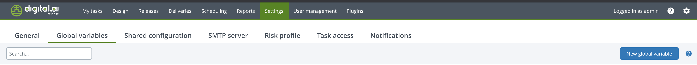

# XL Release Trigger API

[![Build Status][xlr-release-trigger-api-travis-image]][xlr-release-trigger-api-travis-url]
[![Codacy Badge][xlr-release-trigger-api-codacy-image] ][xlr-release-trigger-api-codacy-url]
[![License: MIT][xlr-release-trigger-api-license-image]][xlr-release-trigger-api-license-url]
[![Github All Releases][xlr-release-trigger-api-downloads-image]]()

## Preface

This document describes the functionality provided by the XL Release xlr-release-trigger-api.

See the [XL Release reference manual](https://docs.xebialabs.com/xl-release) for background information on XL Release and release automation concepts.

This is a 'See It Work' plugin project, meaning the code base includes functionality that makes it easy to spin up and configure a dockerized version of the XebiaLabs platform with this plugin api already installed. Using the provided test data, you can then try out the plugin features. This is useful for familiarizing yourself with the plugin functionality, for demonstrations, for testing and for further plugin development. [See the Demo/Dev section.](#to-run-demo-or-dev-version-set-up-docker-containers-for-both-xlr-and-the-mock-server)

The plugin code base also includes a gradle task for [automatic integration testing](#to-run-integration-tests).

## Overview

The xlr-release-trigger-api plugin implements a custom REST API that will create a release, populate release variables with POST parameters, and then schedule or start the release. A possible use case whould be to kick off a release from a third party product such as JIRA.
The plugin is an enhancement of the standard REST API (described [here](https://docs.xebialabs.com/xl-release/latest/rest-docs/#create-a-release-from-template)) in that the XLR template for the release can be referenced within the POST parameters using an abstracted key name rather than just by template title or template id. Additionally, if the new release must be stored in a folder, the folder can be identified by a key name rather than an XLR folder id. This provides the benefit of decoupling the third party product configuration from XLR configuration details. For example, a template can be referenced as 'Team Two Template' within the rest call from the third party product and the xlr-release-trigger-api plugin will then map the key name to the actual template id.

## Requirements
*  **XL Release**   9.0.0+

## Installation

* Copy the latest JAR file from the [releases page](https://github.com/xebialabs-community/xlr-release-trigger-api/releases) into the `XL_RELEASE_SERVER/plugins/__local__` directory.
* Restart the XL Release server.

## Usage

If you plan to identify the XLR template or folder using a key name, you must set up a global variable of type map within XLR to map key names to actual XLR template or folder ids. [Details and examples below.](TODO) Find information about identifying ids within XL Release [here](https://docs.xebialabs.com/xl-release/how-to/how-to-find-ids/)

### Choose a release creation type

To use the api, you must first decide what action you want XLR to take. Choose one of the following three actions:

  1. create a release from an existing template
  2. create a release from an existing template and then start the release immediately
  3. create a release from an existing template and then schedule an automatic start time

* To simply create the release but not start it, make an HTTP POST request, with a correctly configured POST body ([details below](#example-post-body---create-only)), to...

```bash
http://<your xl release>/api/extension/releasetrigger/create
```

* To create and then immediately start the release, make an HTTP POST request, with a correctly configured POST body (note that the URL ends with /start rather than /create) ([details below](#example-post-body---create-and-start-immediately)), to...

```bash
http://<your xl release>/api/extension/releasetrigger/start
```

* To create the release with a future scheduled automatic start date, make an HTTP POST request, with a correctly configured POST body (that includes a scheduledStartDate and autoStart set to true) ([details below](#example-post-body---create-and-schedule-automatice-future-start)), to...

```bash
http://<your xl release>/api/extension/releasetrigger/create
```

| Http Headers |    |
| ------------ | -- |
| encoding | UTF-8 |
| content-type | application/json |

The POST body will be a JSON object structured like this...

```json
{
    "template_key|template_title|template_id": "template_key or template_title or template_id value" (one is required),
    "title": "release title" (required),
    "description": "description for release" (optional),
    "folder_key|folder_id":"folder key or folder id where this release will be stored" (optional),
    "scheduledStartDate":"mm/dd/yyyy" (optional, but required if autoStart is set to true),
    "dueDate":"mm/dd/yyyy" (optional),
    "owner":"release owner"  (optional),
    "tags":["tag1", "tag2"] (optional),
    "autoStart":true|false (optional),
    "<release_variable_name_1>" : "release_variable_value" (optional),
    ...
}
```

### POST Body JSON Key / Values

| Key Name | Description | Required? |
| ----------- | ----------- | ----------- |
| template_key  | The key name used to look up the template id. Must be configured in XLR global variable map named 'releaseTriggerMap'  [See below](TODO). | Either this or 'template_title' or 'template_id is required. |
| template_title  | The template title, as defined in XLR.| Either this or 'template_key' or 'template_id is required. |
| template_id  | The template id, as defined in XLR. | Either this or 'template_title' or 'template_id is required. |
| title         | Title for the release | Required |
| description   | Description for the release | Optional |
| folder_key   | The key name used to look up the folder id. Must be configured in XLR global variable map named 'releaseTriggerMap'  [See below](TODO).  | Optional |
| folder_id  | The folder id, as defined in XLR. | Optional |
| scheduledStartDate | Scheduled date for the release as mm/dd/yyyy | Optional but is Required if autoStart is set to true |
| dueDate            | Anticipated due date for the release as mm/dd/yyyy | Optional 
| owner              | Owner of the release | Optional |
| tags               | List of tags for the release | Optional |
| autoStart          | 'true' if you want the release to start automatically on the scheduledStartDate.  Note: If autoStart is set to true, you must set the scheduledStartDate as well. | Optional |
| release variables | Any number of release variable names and values.| Optional |

### Using 'template_key' parameter

To use the 'template_key' parameter to identify an XLR Template you must first set up an XLR global variable of type map and name it 'releaseTriggerMap'. Map the key you wish to use to the template id a defined in XLR. [Details here](#set-up-a-global-variable-of-type-key-value-map-within-xlr) Within the POST body, you need to define only one of the following parameters - template_key or template_title or template_id.

### Using 'folder_key' parameter

To use 'folder_key' parameter to identify an XLR Template you must first set up an XLR global variable of type map and name it 'releaseTriggerMap'. Map the key you wish to use to the folder id a defined in XLR. [Details here](#set-up-a-global-variable-of-type-key-value-map-within-xlr) Within the POST body, you need to define only one of the following parameters - folder_key or folder_id.


Note: the global variable must be named 'releaseTriggerMap'.  The 'type' is 'key-value map'.  These are required.

The 'key' part of the map can be any text string.  It may, for example, represent a project id or team name.  The 'value' part is the template name and must match the name of an existing template or folder.  If you don't use the 'template_key' or 'folder_key' parameter in the POST body then you don't need to create this global variable.

### Using 'release variables' parameters

You may optionally pass any number of release variable names and values.  The release variable name used in the JSON body must match an existing release variable name in the template.  The variable JSON type must match the variable type in XL Release.  Any release variable you specify in the JSON body that is not found in the XL Release template is simply ignored.

### Response to the release trigger api call

The response object is...

```json
{
    "entity":
        {
            "release_id":"Applications/Released7ec97f397284d738506c9d41a1f2c64",
            "template_id":"Applications/Release3dfc29e6838f438984be0dd69cd2fab4"
        },
    "stdout":"",
    "stderr":"",
    "exception":null
}
```

The 'template_id' is the XL Release ID for the selected template.  The 'release_id' is the XL Release ID for the generated release.  If an exception was generated as a result of the call, the 'exception' property will have its description.

## Usage Details

### Set up a global variable of type key-value map within XLR

NOTE: This global variable must be named 'releaseTriggerMap'. This global variable will be used by the plugin to map your chosen key name to the actual XLR id for a template or a release folder.

To create a global variable within XLR, click 'Settings' in the top menu, click 'Global variables' and then click 'New Global Variable'.


Create a new variable of type 'key-value map' and name it 'releaseTriggerMap'. Set up the key-value map by choosing a key name and then setting the value to the XLR template id or folder id. Information about finding the XLR id for a template or folder can be found [here](https://docs.xebialabs.com/xl-release/how-to/how-to-find-ids/).

### Example POST body - create only

Your third party product must send a POST body to this URL:

```bash
http://<your xl release>/api/extension/releasetrigger/create
```

```json
{
    "template_key": "Team Two Template",
    "release_title": "Team Two Release No AutoStart",
    "description": "This is a Team Two Release",
    "folder_key":"Team Two Folder"
}
```

### Example POST body - create and start immediately

our third party product must send a POST body to this URL (notice 'start' rather than 'create' at end of URL):

```bash
http://<your xl release>/api/extension/releasetrigger/start
```

```json
{
    "template_id": "Releasee796ac6d5d0b46b09197d9970884d9cb",
    "release_title": "Team One Release Test 1",
    "description": "This is a Team One Release",
    "folder_id": "Applications/Folder1ee657ae74f94d7e87ec581558452e00/Folderc75ed02b091f42b9b06b190d0e7a3625"
}
```

### Example POST body - create and schedule automatice future start

our third party product must send a POST body to this URL:

```bash
http://<your xl release>/api/extension/releasetrigger/create
```

```json
{
    "template_key": "Team Two Template",
    "release_title": "Team Two Release Test 1",
    "description": "This is a Team Two Release",
    "folder_key":"Team Two Folder",
    "autoStart":true,
    "scheduledStartDate":"06/03/2025"
}
```

### Other example POST bodies

```json
{
    "template_key": "Team Two Template",
    "release_title": "Team Two Release Test 1",
    "description": "This is a Team Two Release",
    "folder_key":"Team Two Folder",
    "dueDate":"06/04/2025",
    "owner":"admin",
    "tags":["tag1", "tag2"]
}
```

```json
{
    "template_title": "Team One Simple Script Template",
    "release_title": "Team One Release Test templateTitleNoFolder",
    "description": "This is a Team One Release"
}
```


## Developers

Build and package the plugins with...

```bash
./gradlew assemble
```

### To run integration tests

1. Clone this github project to your local dev environment
2. You will need to have Docker and Docker Compose installed.
3. The XL-Release docker image uses the community trial license
4. Open a terminal in the root of the xlr-variable-setter-plugin project and run the following gradle task 

```bash
./gradlew clean integrationTest
```

The test will set up a temporary XL Release instance in a docker container. After testing is complete, the test docker container is stopped and removed.

### To run demo or dev version (set up docker containers for both XLR and the mock server)

NOTE:

1. For requirements, see the 'To run integration tests' above.
2. XL Release will run on the [localhost port 15516](http://localhost:15516/).
3. The XL Release username / password is admin / admin.

* Before running the demo, be sure to create the plugin by opening a terminal, cd into the plugin source code directory, and run

```bash
./gradlew clean build
```

* To run the dev/demo mode, open a terminal, cd into the src/test/resources/docker directory of the plugin code and run

```bash
docker-compose up
```

* Within XLR, you will need to set up your test environment including templates, the global variable 'releaseTriggerMap', and folders. If you would like to use our test setup, simply run the initialize_data.sh script found in your local copy of this github project <project directory>/src/test/resources/docker/initialize/. This will import configuration data into the XLR instance running in docker.
* You can then execute curl commands against the XLR server, thereby imitating a third party product interacting with the xlr-release-trigger-api
* If you are using our test data, you can find example POST body data here - <project directory>/src/test/resources/docker/initialize/testPosts directory.
* Example curl command (this loads the file templateKeyFolderKey.json as the post body):

```bash
    curl --user admin:admin -i -X POST http://localhost:15516/api/extension/releasetrigger/start \
    -H "Content-Type: application/json" \
    --data "@templateKeyFolderKey.json"
```

The response should look something like this:

```json
{"entity":{"release_id":"Applications/Folder1ee657ae74f94d7e87ec581558452e00/Folderc75ed02b091f42b9b06b190d0e7a3625/Releaseef6ef3df8a91413e9d296d47d996562e","template_id":"Applications/Releasee796ac6d5d0b46b09197d9970884d9cb"},"stdout":"","stderr":"","exception":null}
```

If you then log into your XLR running in docker, you should see the completed release.

* To shut down and remove the docker containers - in a terminal, cd to the <project directory>/src/test/resources/docker/ directory, and run

```bash
docker-compose down
```

[xlr-release-trigger-api-travis-image]: https://travis-ci.org/xebialabs-community/xlr-release-trigger-api.svg?branch=master
[xlr-release-trigger-api-travis-url]: https://travis-ci.org/xebialabs-community/xlr-release-trigger-api

[xlr-release-trigger-api-codacy-image]: https://api.codacy.com/project/badge/Grade/88dec34743b84dac8f9aaaa665a99207
[xlr-release-trigger-api-codacy-url]: https://www.codacy.com/app/ladamato/xlr-release-trigger-api

[xlr-release-trigger-api-license-image]: https://img.shields.io/badge/License-MIT-yellow.svg
[xlr-release-trigger-api-license-url]: https://opensource.org/licenses/MIT
[xlr-release-trigger-api-downloads-image]: https://img.shields.io/github/downloads/xebialabs-community/xlr-release-trigger-api/total.svg
